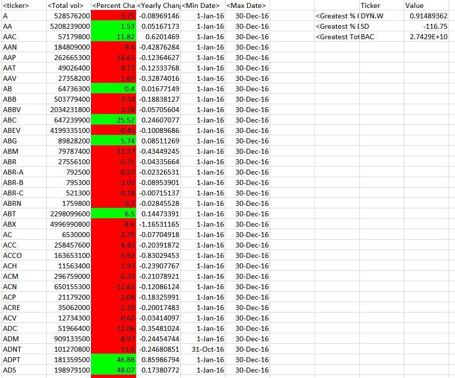

## VisualBasicHardAllSheets
### Summary
This repository uses VBA scripting to analyze real stock market data. 
The analysis shows the Yearly Change, Percent Change and Total Stock Volume per Ticker. 
The information is carved up annually in different sheets and the code runs all of them at once. 
### Technical Details
In order to run the code, it is required Microsoft Visual Basic.
#### Files:
Test Data - Use this while developing scripts. 
Stock Data - Run scripts on this data to generate the final homework report. 
Stock market analyst. 
### Screenshots
2016.JPG 

### Explanations
The outcome is shown in screenshots for reference purpose of the public. 

# VisualBasicHardAllSheets
The VBA of Wall Street 

Easy 
Create a script that will loop through one year of stock data for each run and return the total volume each stock had over that year. 
Display the ticker symbol to coincide with the total stock volume. 

Moderate 
Create a script that will loop through all the stocks for one year for each run and take the following information. 
The ticker symbol. 
Yearly change from opening price at the beginning of a given year to the closing price at the end of that year. 
The percent change from opening price at the beginning of a given year to the closing price at the end of that year. 
The total stock volume of the stock. 
You should also have conditional formatting that will highlight positive change in green and negative change in red. 
The result looks as follows. 

Hard 
The solution includes everything from the moderate challenge and is able to return the stock with the "Greatest % increase", "Greatest % Decrease" and "Greatest total volume". 
Solution looks as follows. 

The script allows it to run on every worksheet, i.e., every year, just by running it once. 

Use the sheet alphabetical_testing.xlsx while developing the code.  
This data set is smaller and allows to test faster. 
The code should run on this file in less than 3-5 minutes. 
